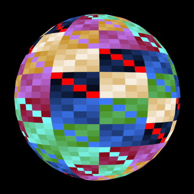
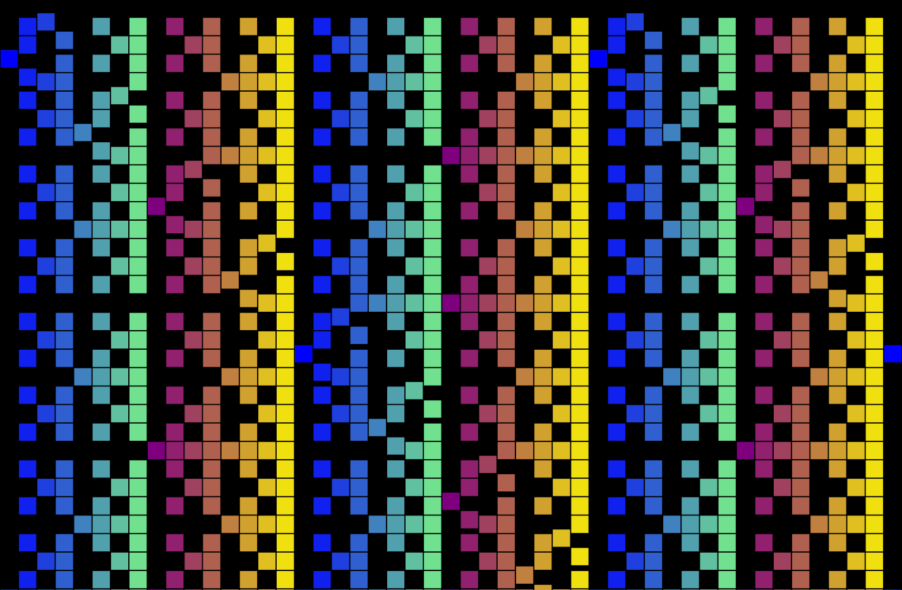
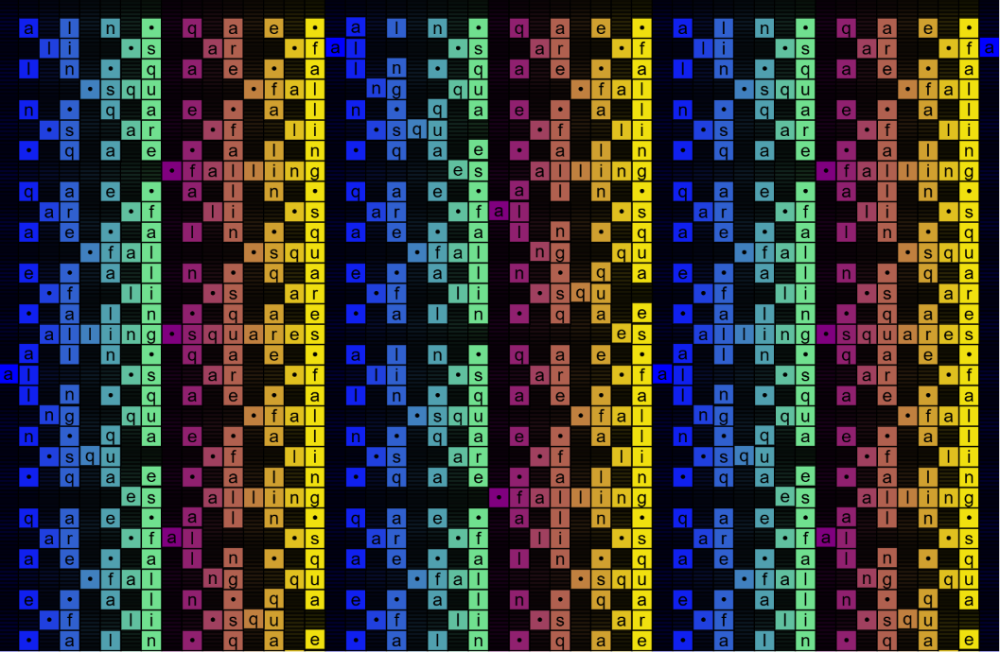
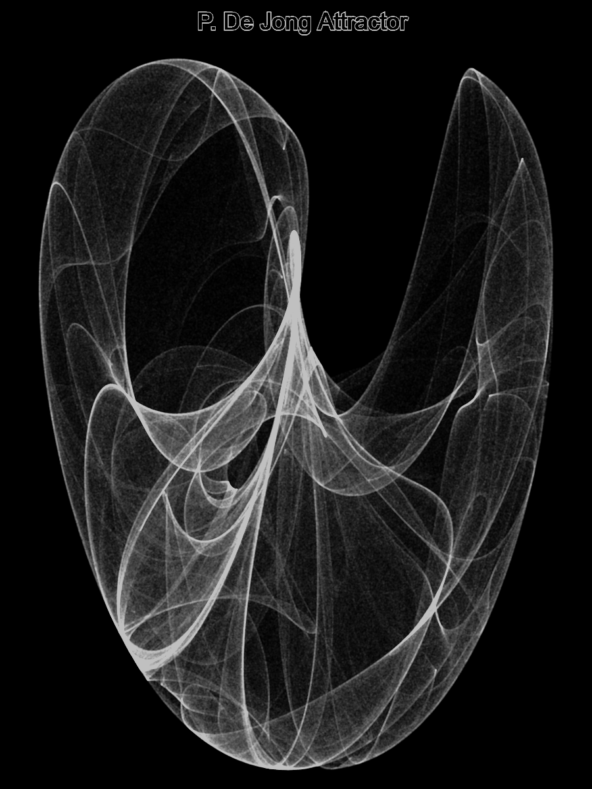
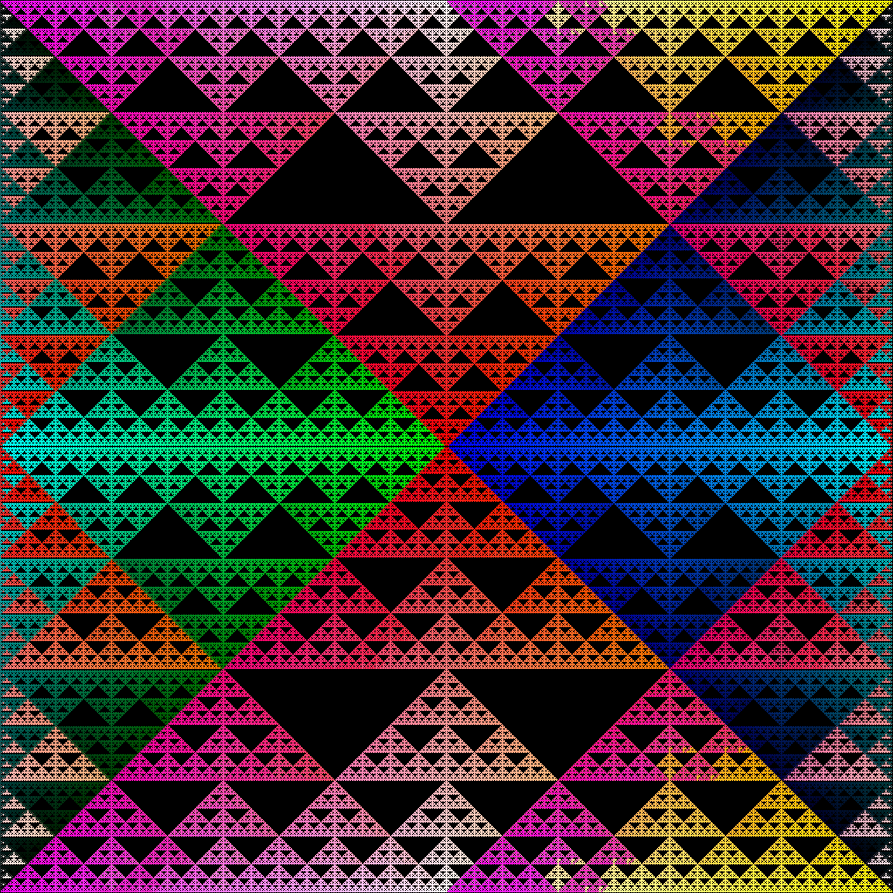
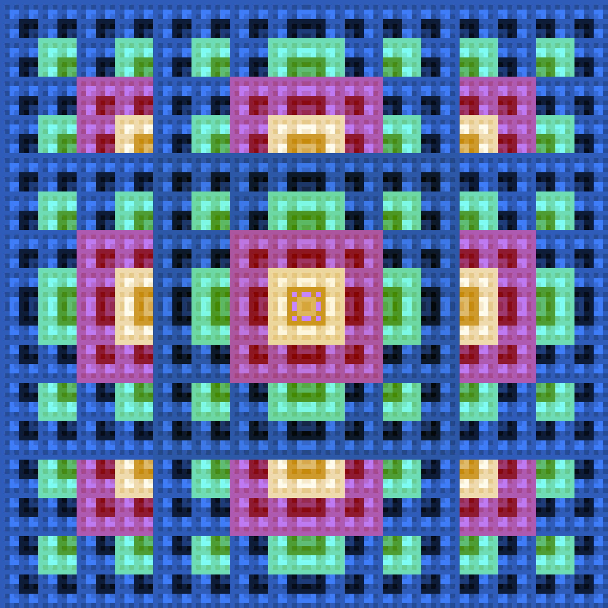
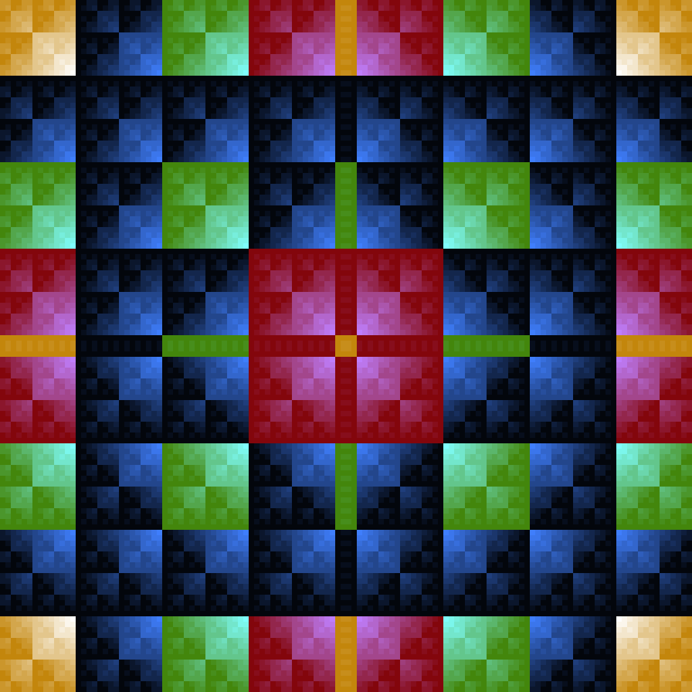

# P5.JS

Exploring [P5.JS](https://p5js.org/) JavaScript library.

View the pieces of code on the [P5.JS website 'My Sketches'](https://editor.p5js.org/KMoerman/sketches)

## Simple Swimmer

Ported from my [original QB64 version](https://github.com/oonap0oo/QB64-projects#simple-swimmer).

[View online](https://editor.p5js.org/KMoerman/full/Z5zEQsANe)

The code on Github:

* Javascript code file [sketch.js](simple-swimmer/sketch.js)

* HTML file to run javascript in browser: [index.html](simple-swimmer/index.html)

Animated GIF file created using the saveGif() function:

## Golden Dragon

One of the classic Iterated Function Systems.

Using information from [https://larryriddle.agnesscott.org/ifs/heighway/goldenDragon.htm](https://larryriddle.agnesscott.org/ifs/heighway/goldenDragon.htm)

[View online](https://editor.p5js.org/KMoerman/full/cFivNPzxW)

The code on Github:

* Javascript code file [sketch.js](golden-dragon/sketch.js)

* HTML file to run javascript in browser: [index.html](golden-dragon/index.html)

Animated GIF file created using the saveGif() function:

## Floaty

A 'creature" with long tentacles that seems to float in circles. All made from math functions

[View online](https://editor.p5js.org/KMoerman/full/Y8FpStIRm)

The code on Github:

* Javascript code file [sketch.js](floaty/sketch.js)

* HTML file to run javascript in browser: [index.html](floaty/index.html)

Animated GIF file created using the saveGif() function:

## Sin tiles

A animated image based on the iteration after choosing a random starting point x,y:

    x = x + sin(y)
    y = y + sin(x)

[View online](https://editor.p5js.org/KMoerman/full/96817Nnir)

The code on Github:

* Javascript code file [sketch.js](sin_files/sketch.js)

* HTML file to run javascript in browser: [index.html](sin_files/index.html)
  

## Bubble Universe

The algoritm is found on many places on the web.

The example used as reference, in Sinclair Basic on a PC by BigEd: 
[https://stardot.org.uk/forums/viewtopic.php?t=25833](https://stardot.org.uk/forums/viewtopic.php?t=25833)

[View online](https://editor.p5js.org/KMoerman/full/211sgJf1G)

[View on Youtube](https://youtu.be/H8qWZb4fJ7Q?si=Xz4OR4ypXZiozKgz)

The code on Github:

* Javascript code file [sketch.js](bubble-universe/sketch.js)

* HTML file to run javascript in browser: [index.html](bubble-universe/index.html)

A still from the animation:

## Bouncing Points

Exploring Vectors and UI sliders in P5.JS

A toy which bounces points inside a circle, influenced by gravity and friction

[View online](https://editor.p5js.org/KMoerman/full/EPs-ahIuN)

The code on Github:

* Javascript code file [sketch.js](vectors/sketch.js)

* HTML file to run javascript in browser: [index.html](vectors/index.html)

[View on Youtube](https://youtu.be/gqJfqqSY-80?si=l5E5JDLH1iAwULUt)

A still from the animation:

## Interference

Interference, a visual effect based on the general idea of two point wave sources with an interference pattern.

The point sources travel in circular paths changing their distance from each other continuously.

This idea was [first implemented using QB64](https://github.com/oonap0oo/QB64-projects#interference)

[View online](https://editor.p5js.org/KMoerman/sketches/DvfOHq_oX)

The code on Github:

* Javascript code file [sketch.js](interference/sketch.js)

* HTML file to run javascript in browser: [index.html](interference/index.html)

[View on Youtube](https://youtu.be/uzFyvvNck2o)

A still from the animation:

## Sum of vectors

Making figures by rotating a series of vectors and plotting the sum.

[View online](https://editor.p5js.org/KMoerman/sketches/eUn-LqfU4)

The code on Github:

* Javascript code file [sketch.js](vector-sum/sketch.js)

* HTML file to run javascript in browser: [index.html](vector-sum/index.html)

Some examples of figures:

The application in a browser:

## Non Periodic

It is based on the function

    sin(PI.x) + sin(x)

which is not periodic because the ratio of their periods is not a rational number.

This code is made to fit in a post on X.com which is limited to 280 characters.

    a=0
    dt=.03
    f=(x)=>150+70*(sin(PI*x)+sin(4.5*x))
    draw=_=>{ 
      a++||(createCanvas(W=300,W),stroke(255))
      background(0,30)
      beginShape(POINTS)
      for(t=0,tt=.0015*a+1;t<75;t+=dt,tt+=dt){
      vertex(f(tt),f(t))}
      endShape()
    }

[View online](https://editor.p5js.org/KMoerman/sketches/h_PMQP6k1)

The code on Github:

* Javascript code file [sketch.js](non-periodic/sketch4.js)

* HTML file to run javascript in browser: [index.html](non-periodic/index4.html)

A GIF made from screen recording the animation:

## Non periodic with feedback

Adding some feedback by adding previous value x to the function argument

    a=0;x=0//non-periodic-with-feedback #p5js
    f=(x)=>sin(PI*x)+sin(4.5*x);m=(x)=>175+85*x
    draw=_=>{ 
      a++||(createCanvas(W=350,W),stroke(W))
      background(0,35)
      beginShape(POINTS)
      for(t=2000;t--;){
      y=f(p=t/30+x);x=f(a/500+p)
      vertex(m(x),m(y))}
      endShape()}

[View online](https://editor.p5js.org/KMoerman/sketches/IOlNecOtU)

The code on Github:

* Javascript code file [sketch.js](non-periodic/sketch6.js)

* HTML file to run javascript in browser: [index.html](non-periodic/index6.html)

A GIF made from screen recording the animation:

## Xor-sphere

Trying the 3D functionality in P5.JS. 

    t=0;b=255;W=382;s=8//xor-sphere #p5js
    d=_=>{T.noStroke();for(x=0;x<W;x+=s)for(y=0;y<W;y+=s){T.fill(r=((x^y)+t)&b,2*r%b,4*r%b);
    T.rect(x,y,s)}}
    draw=_=>{t++||(createCanvas(W,W,WEBGL),noStroke(),T=createGraphics(W,W))
    d();background(0);rotateY(t/200);texture(T);sphere(160)}

[View online](https://editor.p5js.org/KMoerman/sketches/NE2dpXwL2)

The code on Github:

* Javascript code file [sketch.js](xor-sphere/sketch.js)

* HTML file to run javascript in browser: [index.html](xor-sphere/index.html)

A GIF made from screen recording the animation:

## Dropping squares

Using a simple bitwise XOR function to determine a y coordinate for each x coordinate. t is a parameter which increases with each frame.

    y = x XOR t

Or in javascript notation:
   
    y = x^t

The code:

    t=0//Dropping squares #p5js
    draw=_=>{t++||createCanvas(W=784,H=512)
    for(x=0;x<W;x+=16){y=x^t;fill(c=x&255,(x&127)*2,255-c);rect(x%W,y%H,16)}}

[View online](https://editor.p5js.org/KMoerman/sketches/9pCG3DtSG)

The code on Github:

* Javascript code file [sketch.js](munching-squares/sketch2.js)

* HTML file to run javascript in browser: [index.html](munching-squares/index2.html)

A GIF made from screen recording the animation; the real output is smoother:

## Falling squares with text

Adding some text to the animation

The code:

    t=0//Falling squares w text #p5js
    s='falling•squares•'
    draw=_=>{t++||createCanvas(W=784,H=512)+textAlign(CENTER,CENTER)+textSize(14)
    for(x=0;x<W;x+=16){y=x^t;fill(r=x&255,(x&127)*2,255-r);rect(x,v=y%H,16)
    fill(0);text(s[(x/16+floor(y/16))%16],x+8,v+8)}}

[View online](https://editor.p5js.org/KMoerman/sketches/VvHqk2a53)

The code on Github:

* Javascript code file [sketch.js](munching-squares/sketch3.js)

* HTML file to run javascript in browser: [index.html](munching-squares/index3.html)

A still from the animation:

## P. De Jong Attractor

A strange attractor defined by a system of equations which calculate new x,y values from the previous set. See reference page [Peter de Jong Attractors](https://paulbourke.net/fractals/peterdejong/)

    xn+1 = sin(a yn) - cos(b xn)
    yn+1 = sin(c xn) - cos(d yn)

a,b,c,d are the four parameters, tend to be sensitive to changes.

[View online](https://editor.p5js.org/KMoerman/sketches/AATnPmmJ6)

The code on Github:

* Javascript code file [sketch.js](p-de-jong-attractor/sketch.js)

* HTML file to run javascript in browser: [index.html](p-de-jong-attractor/index.html)

The created image:

## Sierpinski's dream

An animation which draws Sierpinki's triangles using only a OR function

    //Sierpiński's dream #p5js
    t=0;d=255
    draw=_=>{t++||createCanvas(W=2*(w=256),W)+background(0)
    for(k=W;k--;){y=k|t%W;x=(t-k)%W;stroke((y>w)*d,t&d,k&d);point(x,W-y);point(x,y)}}

[View online](https://editor.p5js.org/KMoerman/sketches/4ATj0wy0U)

The code on Github:

* Javascript code file [sketch.js](sierpinskis-dream/sketch.js)

* HTML file to run javascript in browser: [index.html](sierpinskis-dream/index.html)

A still from the animation:

## 'andxor' vibes

For this animation the code uses nested loops to visit each x,y position of one quarter of the image. The color of this position is determined by the basic form:

    x AND y XOR t

where t is a ever increasing time value
The other 3 quarters of the image are mirrored copies of the first.

    t=0;d=4,w=256//andxor vibes #p5js
    r=(x,y)=>rect(x,y,d)
    draw=_=>{t++||createCanvas(W=2*w-d,W)+noStroke()
    for(y=0;y<w;y+=d)for(x=0;x<w;x+=d){q=(x<<1)&(y<<1)^(t>>2)
    fill(q%257,(q%129)*2,(q%65)*4);r(x,y);r(x,v=W-y);r(u=W-x,y);r(u,v)}}

[View online](https://editor.p5js.org/KMoerman/sketches/Ydk3C-kvu)

[View animation on Youtube](https://youtube.com/shorts/GyZFgGQoy8w?feature=share)

The code on Github:

* Javascript code file [sketch.js](andxor-vibes/sketch.js)

* HTML file to run javascript in browser: [index.html](andxor-vibes/index.html)

A still from the animation:

## Shifting madness

For this version the code also uses nested loops to visit each x,y position of one quarter of the image, but the colors are determined by:

    (x-t) AND (y-t)

The other 3 quarters are coppied and flipped accordingly. It gives munching squares like patterns which move away from the center.

    t=0;d=4,w=256//shifting madness #p5js
    f=(k,l)=>{scale(k,l);image(c,-w,-w)}
    draw=_=>{t++||createCanvas(W=2*w,W)+noStroke()
    for(y=0;y<w;y+=d)for(x=0;x<w;x+=d){q=(x+t)&(y+t)
    fill(q&255,(q<<1)&255,(q<<2)&255);rect(x,y,d)}
    c=get(0,0,w,w);translate(w,w);f(1,-1);f(-1,1);f(1,-1)}

[View online](https://editor.p5js.org/KMoerman/sketches/w-MahJmnU)

[View animation on Youtube](https://youtube.com/shorts/M0LM4QfItpQ?feature=share)

The code on Github:

* Javascript code file [sketch.js](andxor-vibes/sketch2.js)

* HTML file to run javascript in browser: [index.html](andxor-vibes/index2.html)

A still from the animation:

