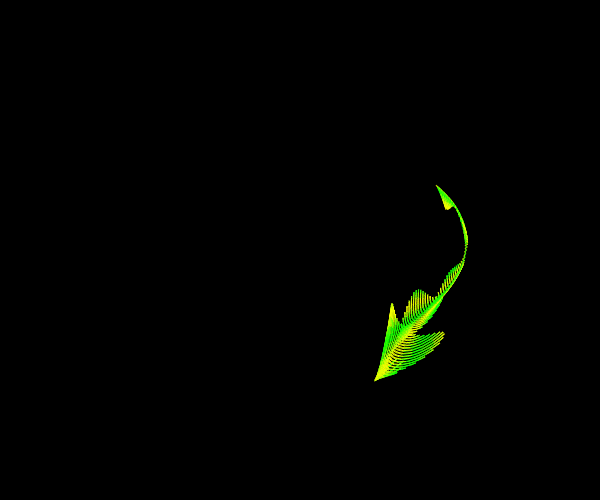
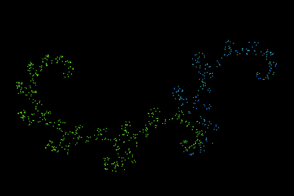
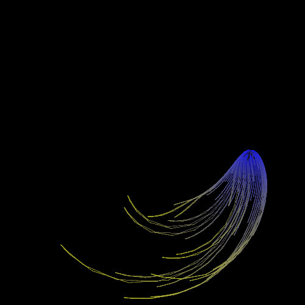
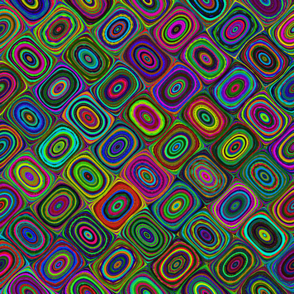
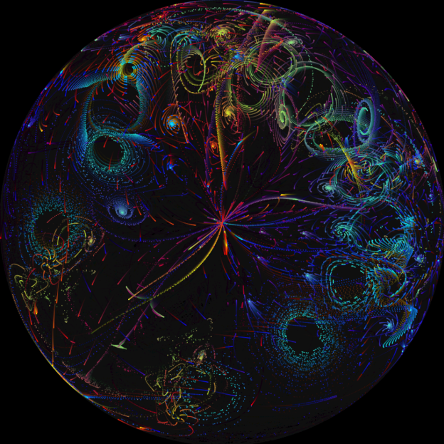
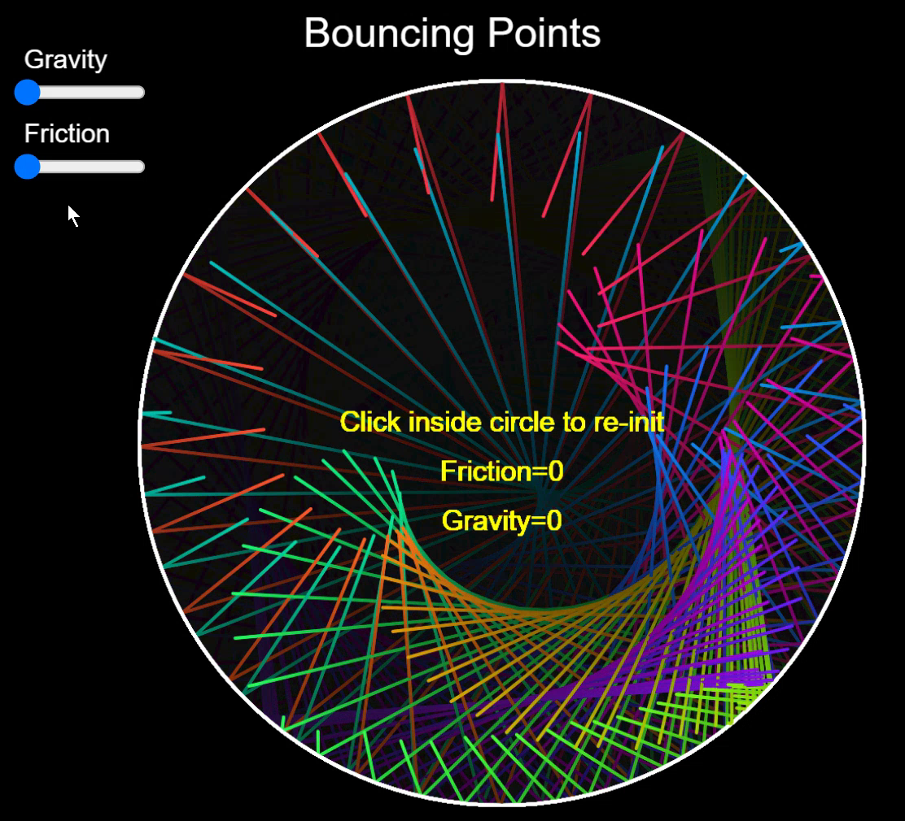
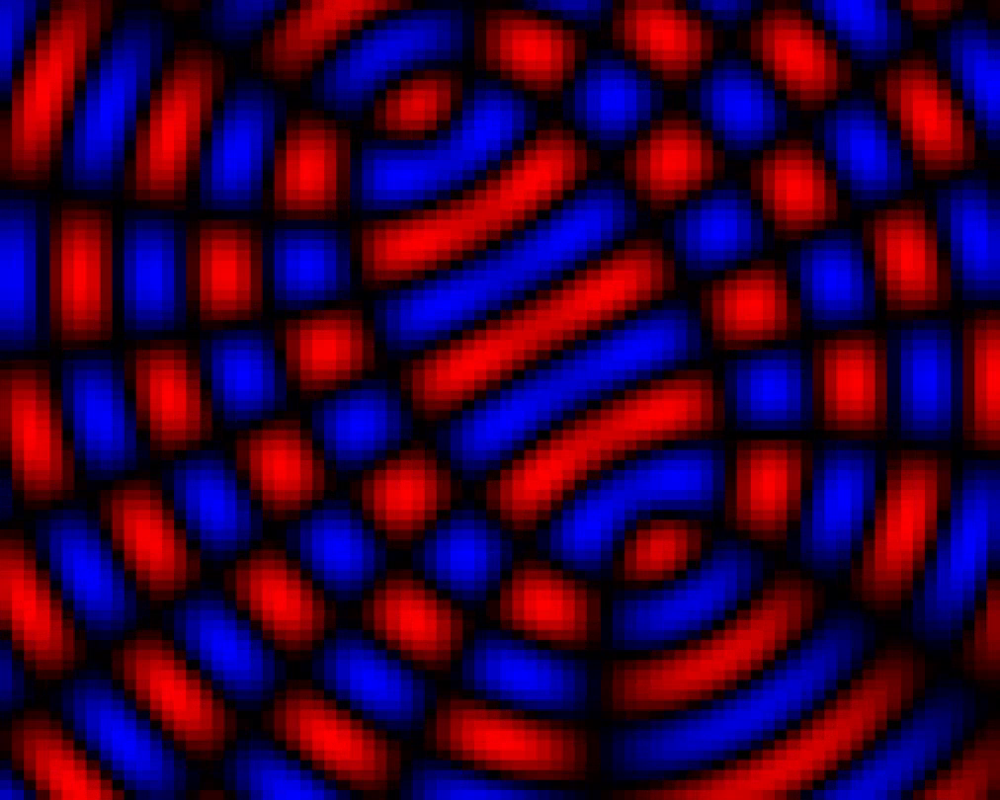

# P5.JS

Exploring [P5.JS](https://p5js.org/) JavaScript library.

View the pieces of code on the [P5.JS website 'My Sketches'](https://editor.p5js.org/KMoerman/sketches)

## Simple Swimmer

Ported from my [original QB64 version](https://github.com/oonap0oo/QB64-projects#simple-swimmer).

[View online](https://editor.p5js.org/KMoerman/full/Z5zEQsANe)

The code on Github:

* Javascript code file [sketch.js](simple-swimmer/sketch.js)

* HTML file to run javascript in browser: [index.html](simple-swimmer/index.html)

Animated GIF file created using the saveGif() function:

## Golden Dragon

One of the classic Iterated Function Systems.

Using information from [https://larryriddle.agnesscott.org/ifs/heighway/goldenDragon.htm](https://larryriddle.agnesscott.org/ifs/heighway/goldenDragon.htm)

[View online](https://editor.p5js.org/KMoerman/full/cFivNPzxW)

The code on Github:

* Javascript code file [sketch.js](golden-dragon/sketch.js)

* HTML file to run javascript in browser: [index.html](golden-dragon/index.html)

Animated GIF file created using the saveGif() function:

## Floaty

A 'creature" with long tentacles that seems to float in circles. All made from math functions

[View online](https://editor.p5js.org/KMoerman/full/Y8FpStIRm)

The code on Github:

* Javascript code file [sketch.js](floaty/sketch.js)

* HTML file to run javascript in browser: [index.html](floaty/index.html)

Animated GIF file created using the saveGif() function:

## Sin tiles

A animated image based on the iteration after choosing a random starting point x,y:

    x = x + sin(y)
    y = y + sin(x)

[View online](https://editor.p5js.org/KMoerman/full/96817Nnir)

The code on Github:

* Javascript code file [sketch.js](sin_files/sketch.js)

* HTML file to run javascript in browser: [index.html](sin_files/index.html)
  

## Bubble Universe

The algoritm is found on many places on the web.

The example used as reference, in Sinclair Basic on a PC by BigEd: 
[https://stardot.org.uk/forums/viewtopic.php?t=25833](https://stardot.org.uk/forums/viewtopic.php?t=25833)

[View online](https://editor.p5js.org/KMoerman/full/211sgJf1G)

[View on Youtube](https://youtu.be/H8qWZb4fJ7Q?si=Xz4OR4ypXZiozKgz)

The code on Github:

* Javascript code file [sketch.js](bubble-universe/sketch.js)

* HTML file to run javascript in browser: [index.html](bubble-universe/index.html)

A still from the animation:

## Bouncing Points

Exploring Vectors and UI sliders in P5.JS

A toy which bounces points inside a circle, influenced by gravity and friction

[View online](https://editor.p5js.org/KMoerman/full/EPs-ahIuN)

The code on Github:

* Javascript code file [sketch.js](vectors/sketch.js)

* HTML file to run javascript in browser: [index.html](vectors/index.html)

A still from the animation:

## Interference

Interference, a visual effect based on the general idea of two point wave sources with an interference pattern.

The point sources travel in circular paths changing their distance from each other continuously.

This idea was [first implemented using QB64](https://github.com/oonap0oo/QB64-projects#interference)

[View online](https://editor.p5js.org/KMoerman/sketches/DvfOHq_oX)

The code on Github:

* Javascript code file [sketch.js](interference/sketch.js)

* HTML file to run javascript in browser: [index.html](interference/index.html)

[View on Youtube](https://youtu.be/uzFyvvNck2o)

A still from the animation:

